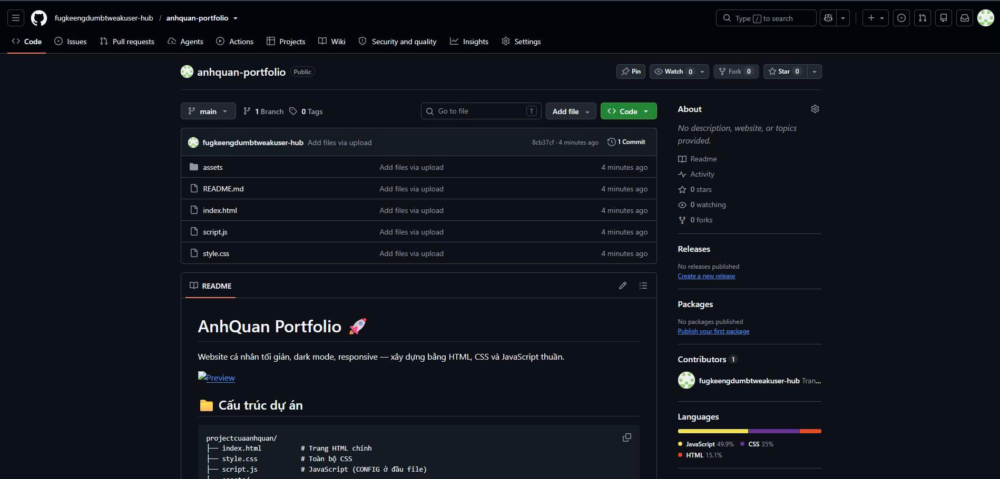

# AnhQuan Portfolio 🚀

Website cá nhân tối giản, dark mode, responsive — xây dựng bằng HTML, CSS và JavaScript thuần.



## 📁 Cấu trúc dự án

```
projectcuaanhquan/
├── index.html          # Trang HTML chính
├── style.css           # Toàn bộ CSS
├── script.js           # JavaScript (CONFIG ở đầu file)
├── assets/
│   ├── favicon.svg     # Favicon SVG
│   └── avatar.png      # Ảnh đại diện (tự thêm)
└── README.md           # File hướng dẫn này
```

## ✏️ Hướng dẫn chỉnh sửa nội dung

**Tất cả thông tin cá nhân nằm trong object `CONFIG` ở đầu file `script.js`.**

### Thay đổi tên & tagline

```js
const CONFIG = {
  name: 'TênCủaBạn',
  tagline: 'Mô tả ngắn về bạn',
  // ...
};
```

### Thay đổi avatar

1. Đặt ảnh vào thư mục `assets/` (ví dụ: `assets/avatar.png`)
2. Cập nhật đường dẫn trong CONFIG:

```js
avatar: './assets/avatar.png',
```

> **Lưu ý:** Nếu không có ảnh, website sẽ tự hiển thị chữ viết tắt "AQ".

### Thay đổi thông tin giới thiệu

```js
about: {
  paragraphs: [
    'Đoạn 1...',
    'Đoạn 2...'
  ],
  details: [
    { label: 'Location', value: '📍 Vietnam' },
    { label: 'Focus', value: '🎯 Web Development' },
    // Thêm hoặc xóa dòng ở đây
  ]
},
```

### Thay đổi kỹ năng

```js
skills: [
  { name: 'HTML5', icon: 'html' },
  { name: 'CSS3', icon: 'css' },
  // Thêm hoặc xóa kỹ năng ở đây
],
```

**Các icon có sẵn:** `html`, `css`, `js`, `python`, `git`, `vscode`, `figma`, `github`, `discord`, `instagram`, `facebook`, `twitter`, `youtube`, `tiktok`, `linkedin`

### Thay đổi dự án

```js
projects: [
  {
    title: 'Tên dự án',
    description: 'Mô tả ngắn',
    image: './assets/project1.png',  // hoặc để '' nếu không có ảnh
    tech: ['HTML', 'CSS'],
    github: 'https://github.com/username/repo',
    demo: 'https://demo-url.com'     // để '' nếu không có
  },
  // Thêm nhiều dự án bằng cách thêm object mới
],
```

### Thay đổi liên kết mạng xã hội

```js
social: [
  { platform: 'GitHub', url: 'https://github.com/username', icon: 'github' },
  { platform: 'Discord', url: 'https://discord.gg/invite-code', icon: 'discord' },
  { platform: 'Instagram', url: 'https://instagram.com/username', icon: 'instagram' },
  { platform: 'Facebook', url: 'https://facebook.com/username', icon: 'facebook' },
  // Thêm hoặc xóa mạng xã hội ở đây
],
```

### Thay đổi email

```js
email: 'email-cua-ban@example.com',
```

### Thay đổi favicon

Thay file `assets/favicon.svg` bằng favicon của bạn. Có thể dùng SVG hoặc PNG.

---

## 🚀 Deploy lên GitHub Pages

### Bước 1: Tạo repository trên GitHub

1. Truy cập [github.com/new](https://github.com/new)
2. Đặt tên repository (ví dụ: `portfolio` hoặc `username.github.io`)
3. Chọn **Public**
4. **Không** tick "Add a README file" (đã có sẵn)
5. Nhấn **Create repository**

### Bước 2: Upload code

**Cách 1: Upload trực tiếp trên GitHub**
1. Trong repository vừa tạo, nhấn **uploading an existing file**
2. Kéo thả tất cả file vào
3. Nhấn **Commit changes**

**Cách 2: Dùng Git (nếu đã cài)**
```bash
cd đường-dẫn-tới-thư-mục-project
git init
git add .
git commit -m "Initial commit: portfolio website"
git branch -M main
git remote add origin https://github.com/username/repository-name.git
git push -u origin main
```

### Bước 3: Bật GitHub Pages

1. Vào **Settings** → **Pages**
2. Ở mục **Source**, chọn **Deploy from a branch**
3. Chọn branch **main** và folder **/ (root)**
4. Nhấn **Save**
5. Chờ 1-2 phút, website sẽ có tại: `https://username.github.io/repository-name/`

> **Mẹo:** Nếu đặt tên repository là `username.github.io` (thay `username` bằng GitHub username thật), website sẽ có URL ngắn hơn: `https://username.github.io/`

---

## 🛠️ Phát triển local

Mở file `index.html` trực tiếp bằng trình duyệt, hoặc dùng Live Server:

```bash
# Nếu có Python
python -m http.server 8000

# Nếu có Node.js
npx serve .

# Hoặc dùng VS Code extension "Live Server"
```

---

## 📋 Tính năng

- ✅ Dark mode, thiết kế tối giản
- ✅ Responsive (mobile, tablet, desktop)
- ✅ Scroll reveal animations
- ✅ Đồng hồ hiển thị giờ Việt Nam
- ✅ Copy email với một click
- ✅ Tối ưu SEO cơ bản
- ✅ Hỗ trợ `prefers-reduced-motion`
- ✅ Không dependency bên ngoài
- ✅ Tương thích GitHub Pages

---

## 📄 License

Sử dụng tự do. Có thể chỉnh sửa và chia sẻ thoải mái.

